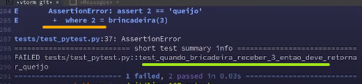
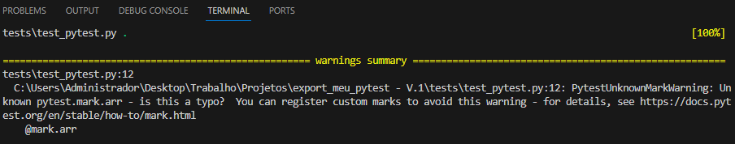
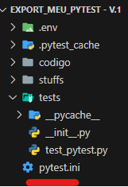
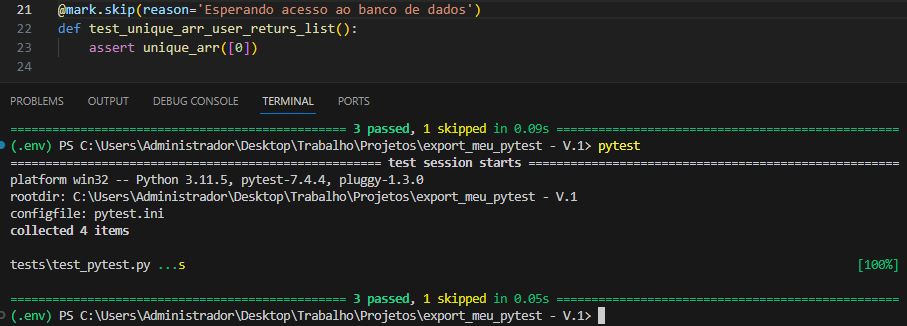
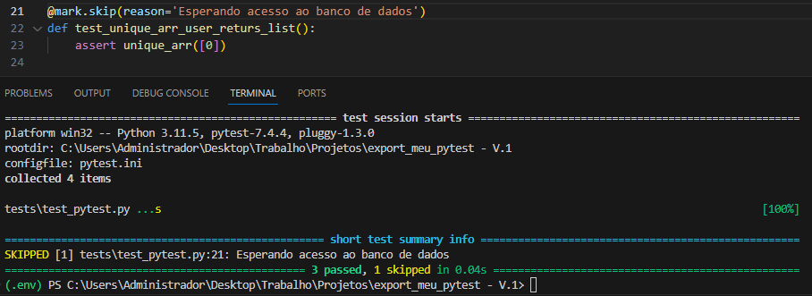
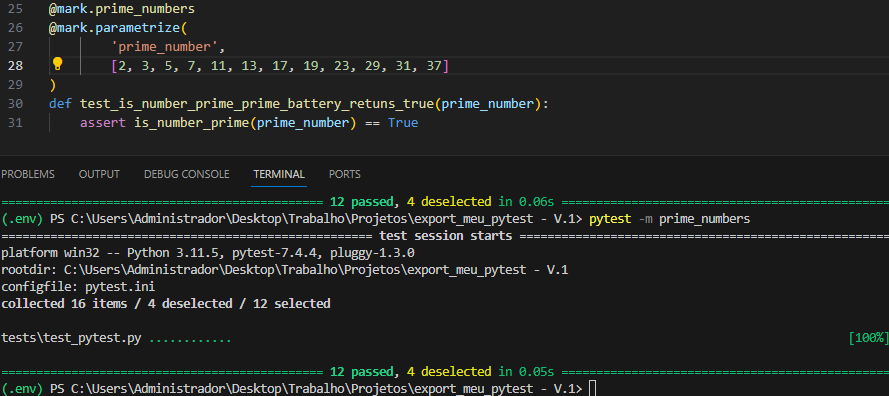
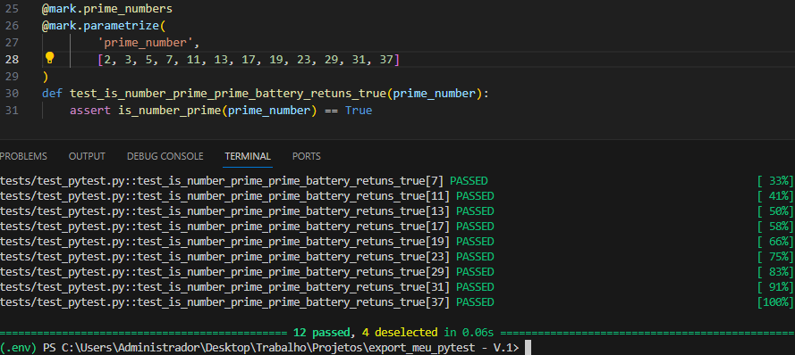

# TDD - Desenvolvimento Guiado por Testes


Todo teste é criado com no minimo três etapas, em nosso caso
utilizamos a metodologia **(GWT)**

- Given (Dado)
- When (Quando)
- Then (Então)

Dados (Given) são os valores que iremos passar ao que queremos 
testar (Quando/When), e então esperamos que algo especifico aconteção (Then/ Então) 

<small>***Nota***</small>
Também temos outra metodologia entitulada de **(AAA)**, neste caso as três etapas
se chamam:
- Arange
- Act
- Assert

Ela basicamente tem o mesmo funcionamento do teste (GWT), pelo menos ambas buscam chegar na
mesmo caminho

## Executar o pytest:
Rode o comando `pytest` em seu terminal.


#### Dicas: 
sempre coloque um arquivo __init__.py na pasta do 
/tests 

(para que ele entenda que é um pacote)

**IMPORTANTE!**

Toda vez que tivermos um erro e ele não ser `AssertionError` significa que existe um erro na estrutura do código e não efetivamente o que o teste testa (No caso Acertamos o GW mas falhamos no T Then)

### Evite ao máximo o duplo assert

Um `assert` pode ser considerado como uma "garantia", isto é, estamos impondo que o código garanta que aquela condição seja verdadeira. Quando colocamos mais de um `assert`, estamos "responsabilizando" demais um teste, visto que ele vai ter que garantir mais coisas. Uma boa prática é por sempre um assert por teste.

### Entendendo um pouco do que o pytest nos fala

Leve em consideração este bloco de código:
```python
def brincadeira(numero):
	if numero == 1:
		return 1
	return 2


def test_quando_brincadeira_receber_3_então_deve_retornar_queijo():
	assert brincadeira(3) == 'queijo'
```


Na imagem a seguir, perceba as linhas grifadas:



na linha 284 tivemos um problema de `AssertionError` onde a linha 285, que está <span style="color: orange; font-weight:bold">grifada de laranja</span> está mostrando que o where (onde) está dando este erro, mais precisamente:

- +: Indica que algo está sendo adicionado ou comparado.
- where: Indica a condição ou contexto onde o erro ocorreu.

Ou seja, o que aconteceu é que a função retornou 2, indicada no where, contudo, era esperado a string 'queijo'

Já na <span style="color: green; font-weight:bold">linha verde</span> da imagem, podemos perceber exatamente qual é o nome do arquivo que falhou!

### tags no terminal para testes:

- `pytest -x` Vai parar os testes assim que encontrar um erro;

- `pytest --pdb` Se o teste falhar chama o debugger no escopo que estamos fazendo o teste (O debugger possibilita a escrita no terminal, deixando que a gente acesse as variáveis do escopo e fazer outros testes de debug) 

- `pytest -s` "show std out" é o comando para debuggar que mostra as saídas no console, serve naquele famoso print("Entrei aqui") para saber onde a logica está. Caso fosse feito com apenas o --pdb, não mostraria as saídas do terminal

- `pytest -k` É um tipo de filtro que testa apenas os testes com aquela condição. Ex:

```
test_n_1_retorna_bool()

tes_n_par_retorna_float()

tes_n_sim_nao_retorna_bool()

#--- Terminal ---

ptest -k "bool"

# vai rodar:
# test_n_1_retorna_bool()
# tes_n_sim_nao_retorna_bool()
```

- `pytest --ff` Na próxima bateria de testes, o teste que falhou na bateria atual, é o primeiro a ser rodado na próxima execução (Serve para poupar tempo e testar diretamente "o qu intessa")


## Tipos de erros:

- . : Passou
- F : Falhou
- x : Falha esperada
- X : Falha esperada, mas não falhou
- s : Pulou (skiped)

## Como exportar os resultados dos testes:

Digamos que você precise fazer o envio dos testes para seu grupo de desenvolvimento, o pytest tem um comando o qual exporta eles no padrão junitxml (Padrão mais utilizado no mercado). Para execuar basta:

```
pytest --junitxml nome_do_arquivo.xml
```

## Mark
As marcações servem para fazer grupos de teste, para implementar, fazemos o import do mark e utilizamos ele como um decorador, sendo o """método""" o nome desse grupo:

```python
from pytest import mark

#...

@mark.smoke
def test_n_status_server_desactivate()
```

Neste caso, agora temos um mark para o grupo "smoke" o qual nomeamos no seu """método""" do decorador

para chamar no terminal basta utilizar:

`pytest -m nome_do_mark`

Neste caso, passamos como se fosse um nome de variável mesmo, sem a necessidade de ser uma string, igual no pytest -k (pelo que eu entendi, o -m as aspas do mark são opicionais)

Para pular os testes daquele mark (por exemplo, existem testes apenas para mobile mas você está testando uma aplicação em desktop), também é muito fácil basta dar o comando:

`pytest -m "not mark_que_voce_nao_quer"`

## Configurações de teste (Para Marks)

O Pytest possui várias maneiras de você configurar e documentar variáveis no seu teste, você pode ver com mais detalhes [Neste_link](https://docs.pytest.org/en/stable/how-to/mark.html). 

Para criar um """setup""" e configurações para nosso, é preciso definir qual tipo de arquivo vamos usar, alguns tipos aceitos são: `pytest.ini` `pyproject.toml`

Neste caso, vamos utilizar o `pytest.ini`, dentro dele definimos uma estrutura bem básica:
```
[pytest]

markers = arr: indica quando o teste utiliza listas
```

Dessa maneira, estamos documentando os marks que podemos utilizar em nossos testes, caso não defina isto, no terminal, irá subir este erro:



É **importante** colocar o arquivo de configuração no diretório que você está rodando seus testes, (no nosso exemplo seria no: `(.env) PS C:\Users\Administrador\Desktop\Trabalho\Projetos\export_meu_pytest - V.1>`), caso coloque em outro lugar, como na pasta de tests, se você não iniciar do jeito certo, o arquivo não será detectado, dando o mesmo erro. Neste nosso caso, é assim que ficou a estrutura de diretórios, visto o local que estamos rodando o teste:



### Tags embutidas
O pytest fornece um grupo de tags que facilitam o nosso dia a dia em 
coisas que são comuns em várias suites de teste.

- @mark.skip: Para pular um teste
- @mark.skipif: Para pular um teste em determinado contexto
- @mark.xfail: É esperado que esse teste falhe em algum contexto
- @mark.usefixture: Falaremos depois sobre isso
- @mark.parametrize: Para parametrizar testes (próximo slide)

#### Ex da tag embutida skip:

Veja que ao rodar os testes, por padrão, o teste que tinha o skip já foi pulado, indicando na nossa bateria com o s em `...s`



Caso queira ver o motivo de ter pulado o teste, basta iniciar o `pytest -rs`




## @mark.parametrize

O Parametrize cria vários testes em sequencia, cada um sendo implementado como um sub-teste. Ele executa o mesmo teste com parâmetros diferentes.

Sintaxe:

```python

@mark.parametrize(
	'param_1,param_2', # Recebe os nomes dos parâmetros dentro de uma string, sendo divididos por virgula
	[(1,3), (3,5), (5,7)] # Recebe uma lista contendo as tuplas dos parametros que iremos testar
)
def test_funcao_a_se_testada():
	...
```

Exemplo: 
(Ps: foi feito um outro mark para selecionar só ele na parte do teste, já decoradores aceitam ter um stack, foi feita dessa maneira)



Exemplo na forma verboso:
(Nota: A linha de comando para selecionar um mark para teste e mostrar na forma verbosa é: `pytest -m mark_a_ser_testado -v`)

Veja que na forma verbosa, podemos até saber qual foi o parâmetro que foi passado, já que ele está contido nos colchetes [n] 



Nota: Em vários casos, não é interessante passar os parâmetros como: `test_x(entrada, esperado)` usando `@mark.parametrize` pois você aumenta uma camada de complexibilidade em seu teste, além de precisar dar mais manutenções (Complexibilidade, pois precisa saber que o esperado de fato acontece & manutenção, para adição e comportamentos do teste). Neste caso, é recomendado fazer testes separados, com premissas diferentes, de modo que se segmente os testes de acordo com sua premissa do teste; 


Claro, vou expandir a explicação do `xfail` com as informações adicionais que você mencionou.

### `@pytest.mark.xfail` (Expected Failure):

O `xfail` em `pytest` é usado quando você espera que um teste falhe, mas ainda deseja executá-lo. O "x" em `xfail` representa "expected failure". Aqui estão alguns pontos adicionais:

- **'x' representa um teste que esperamos que falhe:**
   - Quando um teste é marcado com `xfail`, significa que você está ciente de que há uma falha esperada na implementação sendo testada.
   - O teste será executado, e se falhar como esperado, será considerado um sucesso; no entanto, se passar, será registrado como um "xfail".
   - Isso é útil quando você está ciente de um problema no código, mas deseja monitorar quando ele é corrigido.

- **'X' representa um teste que esperávamos que falhasse, mas passou:**
   - Se um teste marcado com `xfail` passar inesperadamente, será registrado como um "Xpass".
   - Isso pode ser útil para identificar casos em que uma correção foi feita na implementação, e o teste que anteriormente falhava como esperado agora passa.

- **Integridade em caso de falha não esperada:**
   - Se um teste marcado como `xfail` passar quando não deveria, isso pode indicar que algo mudou na implementação e a falha esperada não está mais ocorrendo.
   - Isso destaca a importância de manter os marcadores `xfail` atualizados à medida que o código é desenvolvido e corrigido.

- **Cenário prático:**
   - Por exemplo, imagine um código que deveria ler apenas arquivos `.docx`, mas, devido a um problema específico, ele também aceita arquivos `.pdf`.
   - Logo, um arquivo você sabe que seu código não suporta, mas que está sendo lido por parte do seu código, pode "contaminar" seu projeto, de forma que gere outras falhas


Em resumo, `xfail` é uma ferramenta útil para lidar com casos em que você espera que um teste falhe, mas também deseja continuar executando-o para monitorar mudanças na implementação ao longo do tempo. Mantenha os marcadores `xfail` atualizados para garantir a integridade dos testes à medida que o código evolui.


### **`@pytest.mark.skipif` (Conditional Skipping):**
   - O marcador `skipif` é usado para condicionalmente pular a execução de um teste com base em alguma condição.
   - Pode ser útil para evitar a execução de testes em ambientes específicos ou quando certas condições não são atendidas.

   Exemplo:
   ```python
   import pytest
   import sys

   @pytest.mark.skipif(sys.version_info < (3, 6), reason="Requires Python 3.6+")
   def test_exemplo_python36():
       assert 1 + 1 == 2
   ```

   Neste exemplo, o teste será pulado se a versão do Python for inferior a 3.6. O motivo (`reason`) é opcional, mas ajuda a fornecer informações adicionais sobre por que o teste está sendo pulado.

Ambos os marcadores são úteis em situações específicas, como quando você tem conhecimento de problemas conhecidos ou quando deseja pular testes em determinadas condições.

